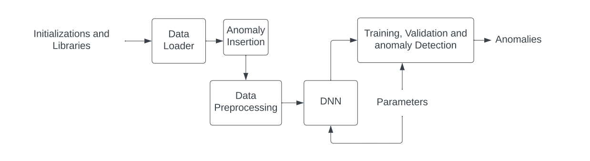

# home-gateway

***1 - Software Analysis:***\
\
The home gateway software is part of the Privacy Preserving IoT Security Management (PRISM) system.
The home gateway software consists of 5 components: the Data Loader module, the Anomaly Insertion module, the Data Pre-processing module, the AI module, the Anomaly Detection module.
We report an overview of PRISM and an explanation of each component of the system (Figure below).


**Data Loader**\
The Data Loader module is used to load the dataset and convert it into the desired data frame. The data should be in NumPy format. The Data Loader scans through the directory of the data and constructs a data frame using the Pandas library. All of the data from the IoT sensors are initially stored in the data frame ```sensors_pd```, where each column represents one sensor and the readings of each sensor are stored in a single element of the first row. Since the objective is to construct the data frame of a single sensor, we use the variable ```Sensor_ID``` to select the desired sensor. The sensory data are used to construct a new data frame ```df``` whose columns are time, reading 1 and reading 2. Note that in this function, an additional feature ```delta_t``` is created to capture the time difference between readings.\
\
**Anomaly Insertion**\
This module produces an artificial anomaly in the given data set.
The Anomaly Insertion function is called with the input arguments ```n```, ```type```, ```dataframe``` and ```id```. The variable ```n``` represents the number of anomalies to be inserted in the data frame, ```type``` represents the type of anomaly, ```dataframe``` is the data frame in which the anomalies will be inserted and finally ```id``` is used to specify the reading value in case that the anomaly generation is an integer ID representing a location. The module reads the earliest and latest time stamps of the sensory readings and then creates a random timestamp within that range in which the anomaly will be inserted at. The randomization is done using the Random library which gives access to the ```randint()``` function.  According to the ```type```, we then create the anomaly. We then concatenated the anomaly dataframe with the dataframe and we order it based on the timestamp of the combined readings.\
By selecting the variables ```pir_time``` and ```pir_key``` it is possible to select the time in which an anomaly is created making the anomalies x seconds apart one another.\
\
**Data Pre-processing**\
The data pre-processing module is used for data pre-processing. Initially the time windows are created using the functions ```Time_Selection``` which builds a list matching the time length of the time window, and the function ```filter_size``` which determined if the list is suitable to train the data. Then the data are concatenated together to create the training data and the validation data which are then individually broken down to inputs and labels being ```X_trainD``` / ```X_valD``` and ```Y_trainD``` / ```Y_valD``` respectively. Finally the data frames are converted into PyTorch Tensors, using the command ```torch.tensor()``` and then into floats using ```.float()``` resulting in the final training and validation data (which are used by the machine learning model) ```X_train```/```X_val``` and ```Y_train``` / ```Y_val``` respectively.\
\
**AI Module**\
The AI module is the core of our system. We use Deep Neural Network architecture to train and validate our model. We use the PyTorch library. The class consists of two definitions, the ```_init_``` which contains all the initialisations of the DNN subparts and the ```forward```, which assembles those subparts with the correct structure.  The parameters used for the DNN are: the number of output classes where in our case they are two (i.e normal, anomaly), ```size_mat``` being the size of the input corresponding to the size of each element in the tensors. Inside the ```_init_``` definition, the initializations of the Relu activation function and fully connected layers are made.\
Right before training, we set the parameters used in the model. Firstly we set the the parameters that are designated training. Those parameters are the optimizer of the model which is SGD accessible using the command ```torch.optim.SGD()```. The criterion is the loss function of the model which is selected to be L1loss via the command ```torch.nn.L1loss()```. The batch size and number of epochs are initialized with 1 and 10 respectively. The permutations which are initialized are used for the batch size implementation during training.\
\
**Anomaly Detection**\
The Anomaly Detection module detects anomalies. 
The main body of the function is broken down in to two subparts. In the first sub part which is used for training, the optimizer’s gradient is initially reset using the PyTorch command ```optimizer.zero_grad()```.  The batches are split down using the permutations created previously leading to ```batch_x``` which is the input data batch and ```batch_y``` which is the label batch. Then ```batch_x``` is used as the input of the LSTM model to produce an output using the PyTorch command ```model.forward()```. The output is then compared with ```batch_y``` using the loss function which was initialized previously. Then the loss generated is backwards propagated using the command ```loss.backwards()``` and finally the gradients of the model are updated using ```optimizer.step()```. The anomalies are detected by comparing the loss of the current validation batch with a threshold decided by the user based on the loss generated during training. If the loss calculated exceeds that threshold, the batch is classified as anomalous. In this subpart the gradient of the model is not altered. The inference time is also calculated for each batch using the time library which gives access to the command ```time.time()```. The inference time taken for a single iteration can be calculated using the difference of the initial time and the end time. The model output of ```batch_x_val``` is compared with the ```batch_y_val``` and if the label is the same as the output, the accuracy variable increments by 1. The final model accuracy is calculated using the true positives plus the true negatives divided by all predictions.

***2 - Testbed:***
* Hardware component used as testbed : Raspberry Pi 4
* Server used: Ubuntu desktop 22.04 LTS, Linux
* Programming Language used: Python 3.9.7
* Data set used: DRI
* Micro SD card 256 GB

***3 - Pre requisites:***
* 64 bit, IoT Device with minimum of 9 GB memory
* Linux OS
* Python3: 3.7-3.9 versions
* PyTorch 1.11.10

***4 - Installation Guide:***\
\
**Step 31:**\
Install the relevant libraries using the following command lines:
```
Pandas: $ sudo apt-get install python3-pandas
```
```
NumPy: $ sudo apt-get install python3-numpy
```
```
Random: $ sudo pip3 install random2
```
PyTorch:\
Initially the correct wheel must be selected (corresponding to the Python version available) via [https://github.com/Qengineering/PyTorch-Raspberry-Pi-64-OS] and downloaded. Then follow the following steps which represent the installation process of PyTorch 1.11.0 for Python 3.9:

download the wheel\
```$ gdown https://drive.google.com/uc?id=1ilCdwQX7bq72OW2WF26Og90OpqFX5g_-```\
install PyTorch 1.11.0\
```$ sudo -H pip3 install torch-1.11.0a0+gitbc2c6ed-cp39-cp39-linux_aarch64.whl```\
clean up\
```$ rm torch-1.11.0a0+gitbc2c6ed-cp39-cp39-linux_aarch64.whl```

In the case of any issues during installation, reference to [https://qengineering.eu/install-pytorch-on-raspberry-pi-4.html] which provides several alternatives.
\
**Step 2:**\
To run the PRISM home gateway software download the file **PRISM_AD.py** and select the correct path of your directory for data analysis.
